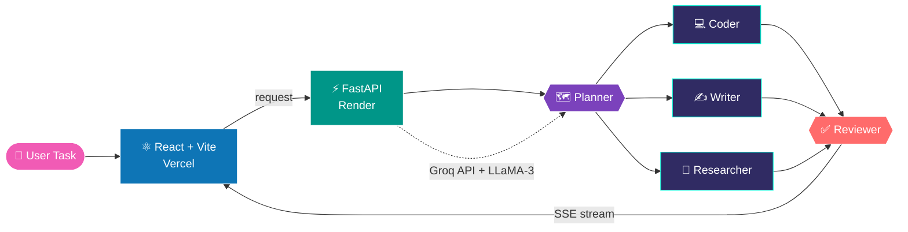
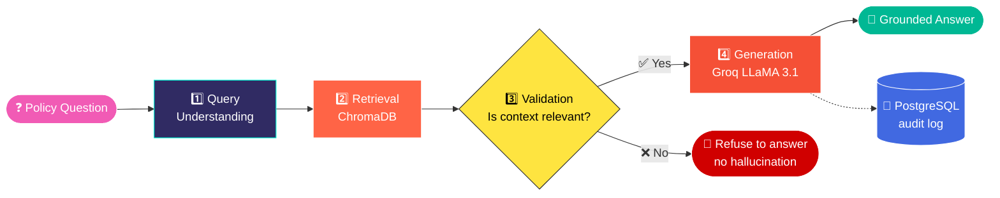
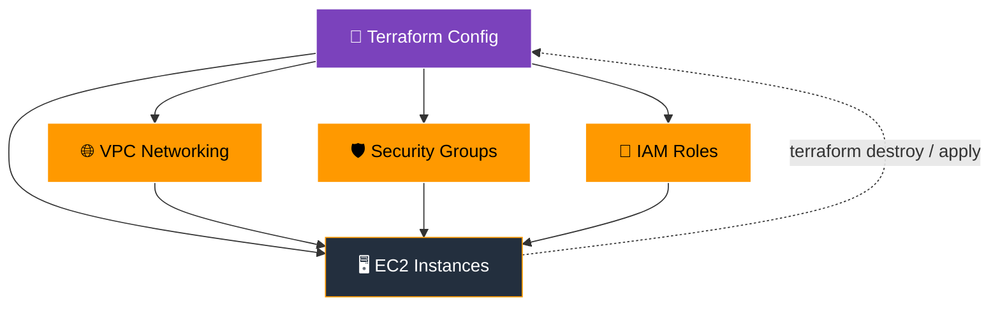
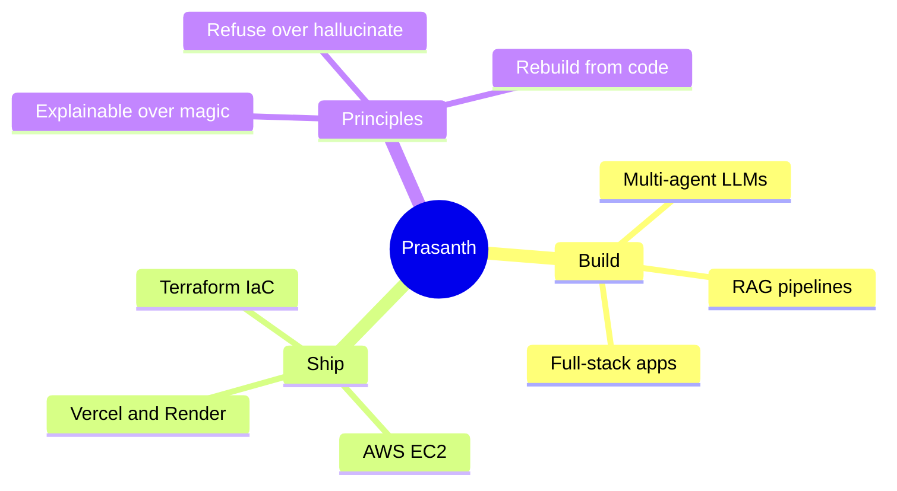

<div align="center">


<a href="https://github.com/prasanth1218">
  
</a>

<br/><br/>

<a href="https://purnaprasanth.netlify.app/"></a>
<a href="https://www.linkedin.com/in/purna-venkata-prasanth-meesala-274790256/"></a>
<a href="mailto:prasanthmeesala2@gmail.com"></a>


</div>

<br/>

## ⚡ 30-Second Recruiter Scan

<div align="center">

| 🎯 Looking for | 🧠 Core strength | ☁️ Infrastructure | 🎓 Education | 🌍 Location |
|:---:|:---:|:---:|:---:|:---:|
| **Entry-level GenAI / Cloud Engineer** | **Multi-agent LLMs + RAG** | **AWS + Terraform (IaC)** | **B.Tech AI & DS, 2026** | **India · Open to relocation** |

</div>

> 💡 **What sets me apart:** I don't just call an LLM API. I design the whole system: agents, retrieval, validation, streaming, deployment and the infrastructure underneath, and I make it **explainable** and **safe against hallucination**.

<br/>

## 👨‍💻 `about_me.py`

```python
class Prasanth:
    name      = "Purna Venkata Prasanth"
    role      = "GenAI / LLM Application Engineer"
    education = "B.Tech, AI & Data Science (2026), Dhanalakshmi Srinivasan University"

    builds = [
        "Multi-agent LLM platforms with real-time SSE streaming",
        "RAG pipelines that refuse instead of hallucinate",
        "AWS infrastructure as code with Terraform",
    ]

    philosophy = "Build it, break it, fix it, ship it."

    currently = {
        "exploring": ["Agentic AI", "Production-grade RAG", "AWS + Terraform"],
        "seeking":   "Entry-level GenAI or Cloud Engineering role with real ownership",
        "relocation": True,
    }

    def contact(self):
        return "prasanthmeesala2@gmail.com"
```

<br/>

## 🧬 How My Projects Actually Work

### 🧠 NexusAI: Multi-Agent LLM Platform *(simplified flow)*



Five specialized agents coordinate on one task and stream results back live. I also solved the unglamorous parts: agent-to-agent message passing, CORS, and dev-vs-prod config. The architecture was written up as a **co-authored research paper**.

[](https://github.com/prasanth1218/multi-agent-nexus)

<br/>

### 🏢 Enterprise AI Research Agent: 4-Step Explainable RAG



I skipped LangChain on purpose and hand-built each step, so every decision the system makes stays **explainable**. A self-healing ingestion job re-indexes documents on startup, so data survives free-tier restarts.

[](https://github.com/prasanth1218/Generative-AI-Projects/tree/main/enterprise-ai-research-agent)

<br/>

### ☁️ AWS + Terraform: Environment as Code



The whole environment can be torn down and rebuilt from code instead of clicked together by hand, with reusable templates that stay consistent across dev and prod.

[](https://github.com/prasanth1218/Terrraform-projects)

<br/>

## 🗂️ More Projects

<table>
<tr>
<td width="50%" valign="top">

### 🩺 Medical Chatbot
**RAG-based Question Answering**

Answers medical queries from grounded context in **Pinecone** instead of letting the LLM answer unaided. I built the PDF ingestion myself: chunking plus **HuggingFace sentence-transformers** embeddings, chained with **LangChain**, served by a **Flask** app with a real-time chat UI.


[](https://github.com/prasanth1218/Generative-AI-Projects/tree/main/End-to-end-Medical-Chatbot-Generative-AI-main)

</td>
<td width="50%" valign="top">

### 📉 Hushh Drop-Off Detection
**Hackathon · Team ZeroDrops**

Flags users dropping off mid-flow on e-commerce/SaaS platforms and re-engages them automatically with push notifications and email recovery flows. Built with a small team: **React** dashboard, **Node/Express/Firebase** backend and a **React Native** app.


[](https://github.com/prasanth1218/hushh-dropoff-dashboard)

</td>
</tr>
</table>

<br/>

## 🛠️ Tech Arsenal

<div align="center">

**🤖 Generative AI**<br/>


**☁️ Cloud & DevOps**<br/>


**💻 Build**<br/>


**📈 ML & Data**<br/>


</div>

<br/>

## 🧩 How I Work



<br/>

## 🎓 Education & Certifications

<div align="center">

| | |
|:---|:---|
| 🎓 **B.Tech, AI & Data Science** | Dhanalakshmi Srinivasan University, Trichy · 2022 – 2026 · CGPA 7.73 / 10 |
| 🏅 **Oracle Certified Foundations Associate: Agentic AI** | Oracle University · Aug 2026 |
| ☁️ **Cloud Computing (AWS)** | LaunchED Global |
| 💻 **Full Stack Web Development** | Skolar |
| 🤝 **Certificate of Membership** | NSPE |

</div>

<br/>

## 📊 GitHub Analytics

<div align="center">


</div>

<br/>

## 🤝 Let's Build Something

<div align="center">

**I'm looking for an entry-level Generative AI or Cloud Engineering role where I can own real systems.**
*Relocation welcome.*

<br/>

<a href="mailto:prasanthmeesala2@gmail.com"></a>
<a href="https://www.linkedin.com/in/purna-venkata-prasanth-meesala-274790256/"></a>
<a href="https://purnaprasanth.netlify.app/"></a>

<br/><br/>


</div>
