


<a href="https://github.com/prasanth1218/multi-agent-nexus"></a>
<a href="https://github.com/prasanth1218/Generative-AI-Projects/tree/main/enterprise-ai-research-agent"></a>
<a href="https://github.com/prasanth1218/Terrraform-projects"></a>
<a href="https://github.com/prasanth1218/Generative-AI-Projects/tree/main/End-to-end-Medical-Chatbot-Generative-AI-main"></a>
<a href="https://github.com/prasanth1218/hushh-dropoff-dashboard"></a>


